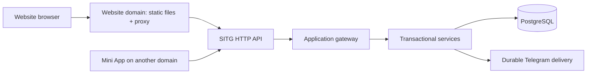

# Website architecture

For website features, start with the [user guide](features.md). This page describes
how those features are organized in the code and connected to the SITG backend.

## Boundaries

This repository contains only the website. The backend owns identity, permissions,
tournament rules, ratings, packet exposure, database transactions, durable jobs, and delivery.
The website calls HTTP endpoints through its own origin. It never connects to PostgreSQL,
the bot's internal TCP protocol, or Telegram's Bot API, and never receives the bot token.

The Mini App is a separate project deployed on a separate hostname. The two clients share
server functionality, not frontend code or builds. Historical `/api/miniapp/...` URL names
remain part of the server's public browser API; they do not load or depend on Mini App UI.
There is no cross-domain single sign-on: each hostname owns its own cookie, and the server
binds each session to its exact origin.

## Code map

| Path | Responsibility |
| --- | --- |
| `src/main.ts` | Browser entry point and lifecycle |
| `src/app.ts` | Website shell, header/account controls, sidebar, resource screens |
| `src/routing/` | Website URL matching, browser history, navigation |
| `src/api/client.ts` | Session bootstrap, authenticated requests, refresh, stable errors |
| `src/api/types.ts` | Response payload types and request options |
| `src/ui/` | DOM helpers and player/tournament profiles, scheduling, library, packet, and admin rendering |
| `src/state/` | Session-storage filter preferences; never credentials |
| `src/i18n/` | English/Russian catalogs |
| `src/styles.css` | Website styles and responsive sidebar; `--site-*` theme variables |
| `api/` | Backend contract snapshots |
| `deploy/nginx.conf.example` | Separate-domain deployment example |

The implementation uses TypeScript, Vite, and direct DOM rendering. Entry point, navigation,
styles, translations, API client, and tests all belong to this repository.
No build step copies files from another project. See [backend integration](backend-integration.md)
for the domain and proxy boundaries.

## Screen organization

The shell fills the viewport; wide result tables scroll inside the content column.
Player and tournament profiles use `src/ui/sections.ts` for one visible section at a time.
`?section=...` selects the initial section; switching buttons updates it without a data reload.
Player history search/sort operates on the API's recent games. SI aggregates and directory
sorting are supplied by the current backend; older responses retain unavailable-state fallbacks.
See [contract additions](api-changes.md) for implemented fields and remaining history limitations.

Authors use a searchable catalogue and a wide statistics table. Subscription management places
creation, templates, and participant assignments in responsive columns. Classic seeding shows
all groups by default, with an optional group filter; CSV imports remain local until saved.

## Request lifecycle

1. Route changes cancel the prior request and stop screen polling.
2. The API client attempts to restore the website session. A 401 switches to guest reads.
3. The server projects the requested resource using current permissions.
4. Rendering uses the returned locale, capabilities, versions, and pagination.
5. Mutations send JSON with CSRF, correlation, and idempotency headers.
6. Successful writes reload authoritative data. A stale-version conflict reloads current state.

Server projections are authoritative. A displayed manager button or cached `is_admin` flag
never grants permission. Do not infer entitlement from a URL or an identifier.

## Project conventions

- Keep browser interaction and presentation here. Request new server operations for new
  business behavior; do not simulate permission checks or rating changes in the browser.
- When adding a route, update route matching, navigation, API types, and relevant UI tests.
- Use returned rulesets and capability descriptors rather than hard-coding new variants.
- Preserve exposure confirmations and explicit destructive-action labels.
- Add localization keys to both catalogs.
- For API changes, update the local schema snapshots and these documents with the backend release.

## API references

- [Authentication and requests](communication.md): session lifecycle and request handling.
- [Read API](api-reads.md): resource routes, filters, and visibility.
- [Mutation API](api-mutations.md): actions, versions, and confirmations.
- [Response types](../src/api/types.ts): payloads consumed by the website.

The bundled [request schemas](../api/request-models.json) were exported from the backend's
Pydantic operation models, and the [HTTP inventory](../api/http-routes.json) from its
registered routes. Each schema under `models` has its own
`$id` and local `$defs`. They are machine-readable artifacts, not an OpenAPI specification.
The inventory is a 2026-09-15 snapshot. Newer verified endpoints are listed in
[contract additions](api-changes.md); a schema name alone does not create an endpoint.
